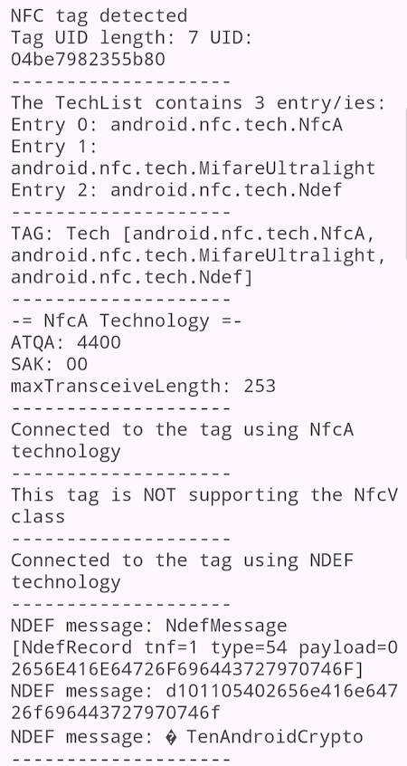

# Android Advanced NFC NfcA App

## data sheets of the described NFC tags

- NXP NTAG21x tags (NTAG213, NTAG215 and NTAG216): https://www.nxp.com/docs/en/data-sheet/NTAG213_215_216.pdf
- NXP MIFARE DESFire EV3 short data sheet (MF3D_H_X3_SDS): https://www.nxp.com/docs/en/data-sheet/MF3D_H_X3_SDS.pdf
- Philips mifare DESFire MF3 IC D40 (M075031, outdated but newer DESFire tags are backwards compatible): https://neteril.org/files/M075031_desfire.pdf
- MIFARE type identification procedure (AN10833): https://www.nxp.com/docs/en/application-note/AN10833.pdf

## NTAG21x command overview

Using the NTAG21x data sheet, the command overview is starting from page 32 onwards. As most of the 
commands are already done by Android's OS I'm focusing on the user commands we are going to run. The 
following descriptions are copy & pasted from the data sheet, all copyrights are going to NXP Semiconductors:

### Get Version Command 0x60h

The GET_VERSION command is used to retrieve information on the NTAG family, the product version, storage 
size and other product data required to identify the specific NTAG21x.

This command is also available on other NTAG products to have a common way of identifying products 
across platforms and evolution steps. The GET_VERSION command has no arguments and replies the version 
information for the specific NTAG21x type.

**Response of the tag:**

The tag is responding an eight bytes long array with 8 data fields:
- byte 00: a fixed, static header '0x00h'
- byte 01: vendor ID of the manufacturer of the tag. A tag from NXP Semiconductors has '0x04h' as identifier
- byte 02: product type of the tag. The NTAG21x family gives '0x04h'
- byte 03: product subtype of the tag. The value is depending on the sensitivity of the tag. A "card type" 
tag has 50pF gives the value '0x02h'
- byte 04: major product version: For NTAG21x tags it is '0x01h'
- byte 05: minor product version: For NTAG21x tags it is '0x01h' meaning Version 0
- byte 06: storage size: see explanation below. An NTAG213 gives '0x0Fh', the NTAG215 returns '0x11h' 
and the NTAG216 is returning '0x13h'
- byte 07: protocol type: An NTAG21x tag returns '0x03h' as the tag is ISO/IEC 14443-3 compliant.

Storage size explanations:

The most significant 7 bits of the storage size byte are interpreted as a unsigned integer value n. 
As a result, it codes the total available user memory size as 2n. If the least significant bit is 0b, 
the user memory size is exactly 2n. If the least significant bit is 1b, the user memory size is between 
2n and 2n+1.

The user memory for NTAG213 is 144 bytes. This memory size is between 128bytes and 256 bytes. Therefore, 
the most significant 7 bits of the value 0Fh, are interpreted as 7d and the least significant bit is 1b.

The user memory for NTAG215 is 504 bytes. This memory size is between 256 bytes and 512 bytes. Therefore, 
the most significant 7 bits of the value 11h, are interpreted as 8d and the least significant bit is 1b.

The user memory for NTAG216 is 888 bytes. This memory size is between 512 bytes and 1024 bytes. Therefore, 
the most significant 7 bits of the value 13h, are interpreted as 9d and the least significant bit is 1b.

Example response: *0x0004040201001303h* gives this information:

```plaintext
Version data dump (8 bytes)
fixedHeader: 0
hardwareVendorId: 4
hardwareType: 4
hardwareSubtype: 2
hardwareVersionMajor: 1
hardwareVersionMinor: 0
hardwareStorageSize: 19
hardwareProtocol: 3
Storage size: >512 bytes
```

### Read Command 0x30h

The READ command requires a start page address, and **returns the 16 bytes of four NTAG21x pages**. For example, 
if address (Addr) is 03h then pages 03h, 04h, 05h, 06h are returned. Special conditions apply if the READ 
command address is near the end of the accessible memory area. The special conditions also apply if at 
least part of the addressed pages is within a password protected area.

In the initial state of NTAG21x, all memory pages are allowed as Addr parameter to the READ command.
- page address 00h to 2Ch for NTAG213
- page address 00h to 86h for NTAG215
- page address 00h to E6h for NTAG216

Addressing a memory page beyond the limits above results in a NAK response from NTAG21x.

A roll-over mechanism is implemented to continue reading from page 00h once the end of the accessible 
memory is reached. Reading from address 2Ah on a NTAG213 results in pages 2Ah, 2Bh, 2Ch and 00h being 
returned.

The following conditions apply if part of the memory is password protected for read access:

If NTAG21x is in the ACTIVE state:

– addressing a page which is equal or higher than AUTH0 results in a NAK response
– addressing a page lower than AUTH0 results in data being returned with the roll-over mechanism 
occurring just before the AUTH0 defined page. For example, if you read protect the tag from page 04 
onwards and you read the page 02, you receive the data as follows: <page02> <page03> <page00> <page01>. 

If NTAG21x is in the AUTHENTICATED state:

– the READ command behaves like on a NTAG21x without access protection

Remark: PWD ("Password") and PACK values can never be read out of the memory. When reading from the 
pages holding those two values, all *00h* bytes are replied to the NFC device instead.

### Fast Read Command 0x3Ah

he FAST_READ command requires a start page address and an end page address and returns the all 
n*4 bytes of the addressed pages. For example if the start address is 03h and the end address is 07h 
then pages 03h, 04h, 05h, 06h and 07h are returned. If the addressed page is outside of accessible 
area, NTAG21x replies a NAK.

In the initial state of NTAG21x, all memory pages are allowed as StartAddr parameter to the FAST_READ command.
- page address 00h to 2Ch for NTAG213
- page address 00h to 86h for NTAG215
- page address 00h to E6h for NTAG216

- Addressing a memory page beyond the limits above results in a NAK response from NTAG21x.

The EndAddr parameter must be equal to or higher than the StartAddr.
The following conditions apply if part of the memory is password protected for read access:
- if NTAG21x is in the ACTIVE state

 –> if any requested page address is equal or higher than AUTH0 a NAK is replied
 
- if NTAG21x is in the AUTHENTICATED state
  
  –> the FAST_READ command behaves like on a NTAG21x without access protection

**Remark**: PWD and PACK values can never be read out of the memory. When reading from the pages 
holding those two values, all 00h bytes are replied to the NFC device instead.

**Remark**: The FAST_READ command is able to read out the whole memory with one command. Nevertheless, 
**receive buffer of the NFC device must be able to handle the requested amount of data** as there is no 
chaining possibility.

You retrieve the "receive buffer size" of your device with the simple NfcA call:
`int maxTransceiveLength = nfcA.getMaxTransceiveLength();`

For e.g., my Samsung device gives me a size 253 for the buffer, so I'm been able to **fastread around 60 pages** 
in one run (60 pages * 4 bytes each = 240 bytes, this includes some protocol overhead bytes). Please 
be aware that each device may have a different buffer size and you cannot rely on a static value !

### Write Command 0xA2h


### Compability Write Command 0xA0h


### Read Counter Command 0x39h


### Read Signature Command: 


### NTAG ACK and NAK responses


### ATQA and SAK responses


This is a simple app showing how to detect and read some data from an NFC tag tapped to the Android's NFC reader.

As there are a lot of questions on Stackoverflow.com that use an **Intent-based** NFC detection system I'm showing here how to use the more 
modern **Reader Mode** for NFC communication.

This is from an answer by *[Andrew](https://stackoverflow.com/users/2373819/andrew)* regarding the two modes:

*Also note that using enableForegroundDispatch is actually not the best way to use NFC. Using enableReaderMode is a newer and much better API 
to use. NFC.enableReaderMode does not use Intent's and gives you more control, it is easy to do NFC operations in a background Thread (which 
is recommended), for writing to NFC Tag's it is much more reliable and leads to less errors.*

There are 4 simples steps to **implement the Reader mode**:

1) in `AndroidManifest.xml` add one line: `<uses-permission android:name="android.permission.NFC" />`
2) in your activity or fragment expand your class definition by `implements NfcAdapter.ReaderCallback`
3) create an `onTagDiscovered` method where all the work with the tag is done.
4) create an `onResume` method to define the technologies and settings for the Reader Mode:

```plaintext
@Override                                                                                      
protected void onResume() {                                                                    
    super.onResume();                                                                          
    if (myNfcAdapter != null) {                                                                
        if (!myNfcAdapter.isEnabled())                                                         
            showWirelessSettings();                                                            
        Bundle options = new Bundle();                                                         
        // Work around for some broken Nfc firmware implementations that poll the card too fast
        options.putInt(NfcAdapter.EXTRA_READER_PRESENCE_CHECK_DELAY, 250);                     
        // Enable ReaderMode for all types of card and disable platform sounds                 
        // The option NfcAdapter.FLAG_READER_SKIP_NDEF_CHECK is NOT set                        
        // to get the data of the tag after reading                                            
        myNfcAdapter.enableReaderMode(this,                                                    
                this,                                                                          
                NfcAdapter.FLAG_READER_NFC_A |                                                 
                        NfcAdapter.FLAG_READER_NFC_B |                                         
                        NfcAdapter.FLAG_READER_NFC_F |                                         
                        NfcAdapter.FLAG_READER_NFC_V |                                         
                        NfcAdapter.FLAG_READER_NFC_BARCODE |                                   
                        NfcAdapter.FLAG_READER_NO_PLATFORM_SOUNDS,                             
                options);                                                                      
    }                                                                                          
}                                                                                              
```
The flags are responsible for defining the NFC classes the NFC reader should detect. If you e.g. delete 
the line `NfcAdapter.FLAG_READER_NFC_A` your app will not detect any NFC tags using the NfcA technology.  

The last flag `NfcAdapter.FLAG_READER_NO_PLATFORM_SOUNDS` is useful for a better user experience. Using 
the **Intent based** mode a system sound will appear when the NFC tag is detected **at the beginning**. 
This causes some uses to move the NFC tag out of the reader field and you receive a "Tag Lost Exception". 
When using the **Reader Mode** the flag prohibits the device to give any feedback to the user. In my app 
I'm running a short *beep* **at the end** or the reading process, signalizing that everything is done. 

Note: **the `onTagDetected` method is not running on the User Interface (UI) thread**, so you are not allowed to write directly to any UI elements like 
e.g. TextViews or Toasts - you need to encapsulate them in a `run onUiTHread` construct. This method is running in an background thread:
```plaintext
runOnUiThread(() -> {
   Toast.makeText(getApplicationContext(), message, Toast.LENGTH_SHORT).show();
});
```

## Steps to read an NFC tag using Reader Mode

Here are some commands to get the first information's about the tag:

`byte[] tagUid = tag.getId();`: receive the tag Unique Identifier (the length depending on tag type).
`String[] techlist = tag.getTechList();`: this is very important as the **NFC tag informs us about the NFC technologies 
it is been able to communicate** with us (e.g. *android.nfc.tech.NfcA*).

Now it is time to **assign the received tag to an NFC technology class**, e.g. to the NDEF class. It is 
important to double check that the ndef variable is not NULL to avoid any errors. If e.g. the ndef-var is not 
null you can **connect** to the NFC tag. Always surround the tag operations with a *try.. catch* clause.

### Example workflow for an NfcA type tag

From the tag I'm getting the *ATQA* and *SAK* value - they are required to identify an NfcA tag on the first level. 
The *maxTransceiveLength* is important when trying to read data from tag - if the data length including some 
protocol bytes is extending this maximum you will receive an error from your device, as the maximum is the 
size of your device's NFC reader unit.

The next steps would be to send commands to the tag using the `transceive` method. I don't show any code for this 
within the app as commands are tag specific.

Please don't forget to close the NfcA class after your work is done. 

```plaintext
NfcA nfcA = null;                                                               
nfcA = NfcA.get(tag);                                                           
if (nfcA == null) {                                                             
    output += "This tag is NOT supporting the NfcA class" + "\n";               
    output += lineDivider + "\n";                                               
} else {                                                                        
    // I'm trying to get more information's about the tag and connect to the tag
    byte[] atqa = nfcA.getAtqa();                                               
    byte sak = (byte) nfcA.getSak();                                            
    int maxTransceiveLength = nfcA.getMaxTransceiveLength();                    
                                                                                
    output += "-= NfcA Technology =-" + "\n";                                   
    output += "ATQA: " + bytesToHex(atqa) + "\n";                               
    output += "SAK: " + byteToHex(sak) + "\n";                                  
    output += "maxTransceiveLength: " + maxTransceiveLength + "\n";             
    output += lineDivider + "\n";                                               
                                                                                
    try {                                                                       
        nfcA.connect();                                                         
        output += "Connected to the tag using NfcA technology" + "\n";          
        output += lineDivider + "\n";                                           
        nfcA.close();                                                           
    } catch (IOException e) {                                                   
        output += "NfcA connect to tag IOException: " + e.getMessage() + "\n";  
        output += lineDivider + "\n";                                           
    }                                                                           
}                                                                               
```

### Example workflow for an NDEF Message

This example has a very limited NDEF workflow and just print out the raw NDEF data. Usually you will divide 
the NDEF Message in separate NDEF records and work with the data depending on the NDEF Record type (not shown 
in this app).

Please don't forget to close the technology after reading is done.

```plaintext
Ndef ndef = null;                                                                                    
ndef = Ndef.get(tag);                                                                                
if (ndef == null) {                                                                                  
    output += "This tag is NOT supporting the NDEF class" + "\n";                                    
    output += lineDivider + "\n";                                                                    
} else {                                                                                             
    try {                                                                                            
        ndef.connect();                                                                              
        output += "Connected to the tag using NDEF technology" + "\n";                               
        output += lineDivider + "\n";                                                                
        NdefMessage ndefMessage = ndef.getNdefMessage();                                             
        String ndefMessageString = ndefMessage.toString();                                           
        byte[] ndefMessageBytes = ndefMessage.toByteArray();                                         
        output += "NDEF message: " + ndefMessageString + "\n";                                       
        if (ndefMessageBytes != null) {                                                              
            output += "NDEF message: " + bytesToHex(ndefMessageBytes) + "\n";                        
            output += "NDEF message: " + new String(ndefMessageBytes, StandardCharsets.UTF_8) + "\n";
        }                                                                                            
        output += lineDivider + "\n";                                                                
        ndef.close();                                                                                
    } catch (IOException e) {                                                                        
        output += "NDEF connect to tag IOException: " + e.getMessage() + "\n";                       
        output += lineDivider + "\n";                                                                
    } catch (FormatException e) {                                                                    
        output += "NDEF connect to tag RunTimeException: " + e.getMessage() + "\n";                  
        output += lineDivider + "\n";                                                                
    }                                                                                                
}                                                                                                    
```

## Screen after reading a tag with an NDEF message



## Example outputs for some tag types

Below you find outputs for some tags with different technologies involved:

### Example for an NTAG216 tag with NfcA technology:
```plaintext
NFC tag detected
Tag UID length: 7 UID: 04be7982355b80
--------------------
The TechList contains 3 entry/ies:
Entry 0: android.nfc.tech.NfcA
Entry 1: android.nfc.tech.MifareUltralight
Entry 2: android.nfc.tech.NdefFormatable
--------------------
TAG: Tech [android.nfc.tech.NfcA, android.nfc.tech.MifareUltralight, android.nfc.tech.NdefFormatable]
--------------------
-= NfcA Technology =-
ATQA: 4400
SAK: 00
maxTransceiveLength: 253
--------------------
Connected to the tag using NfcA technology
--------------------
This tag is NOT supporting the NfcV class
--------------------
This tag is NOT supporting the NDEF class
--------------------
```

### Example for an NTAG216 tag containing an NDEF message:
```plaintext
NFC tag detected
Tag UID length: 7 UID: 04be7982355b80
--------------------
The TechList contains 3 entry/ies:
Entry 0: android.nfc.tech.NfcA
Entry 1: android.nfc.tech.MifareUltralight
Entry 2: android.nfc.tech.Ndef
--------------------
TAG: Tech [android.nfc.tech.NfcA, android.nfc.tech.MifareUltralight, android.nfc.tech.Ndef]
--------------------
-= NfcA Technology =-
ATQA: 4400
SAK: 00
maxTransceiveLength: 253
--------------------
Connected to the tag using NfcA technology
--------------------
This tag is NOT supporting the NfcV class
--------------------
Connected to the tag using NDEF technology
--------------------
NDEF message: NdefMessage [NdefRecord tnf=1 type=54 payload=02656E416E64726F696443727970746F]
NDEF message: d101105402656e416e64726f696443727970746f
NDEF message: enAndroidCrypto
```

### Example for a MIFARE Classic tag:
```plaintext
NFC tag detected
Tag UID length: 4 UID: 641a35cf
--------------------
The TechList contains 3 entry/ies:
Entry 0: android.nfc.tech.NfcA
Entry 1: android.nfc.tech.MifareClassic
Entry 2: android.nfc.tech.NdefFormatable
--------------------
TAG: Tech [android.nfc.tech.NfcA, android.nfc.tech.MifareClassic, android.nfc.tech.NdefFormatable]
--------------------
-= NfcA Technology =-
ATQA: 0400
SAK: 08
maxTransceiveLength: 253
--------------------
Connected to the tag using NfcA technology
--------------------
This tag is NOT supporting the NfcV class
--------------------
This tag is NOT supporting the NDEF class
--------------------
```

### Example for an NFC enabled Credit Card:
```plaintext
NFC tag detected
Tag UID length: 4 UID: b58fcc6d
--------------------
The TechList contains 2 entry/ies:
Entry 0: android.nfc.tech.IsoDep
Entry 1: android.nfc.tech.NfcA
--------------------
TAG: Tech [android.nfc.tech.IsoDep, android.nfc.tech.NfcA]
--------------------
-= NfcA Technology =-
ATQA: 0400
SAK: 20
maxTransceiveLength: 253
--------------------
Connected to the tag using NfcA technology
--------------------
This tag is NOT supporting the NfcV class
--------------------
This tag is NOT supporting the NDEF class
--------------------
```

### Example for an ICODE SLIX tag with NfcV technology:
```plaintext
NFC tag detected
Tag UID length: 8 UID: 18958608530104e0
--------------------
The TechList contains 2 entry/ies:
Entry 0: android.nfc.tech.NfcV
Entry 1: android.nfc.tech.NdefFormatable
--------------------
TAG: Tech [android.nfc.tech.NfcV, android.nfc.tech.NdefFormatable]
--------------------
This tag is NOT supporting the NfcA class
--------------------
-= NfcV Technology =-
DsfId: 00
maxTransceiveLength: 253
--------------------
Connected to the tag using NfcV technology
--------------------
This tag is NOT supporting the NDEF class
--------------------
```
